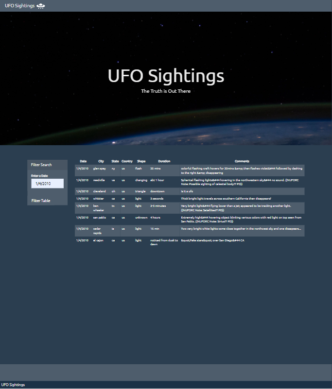
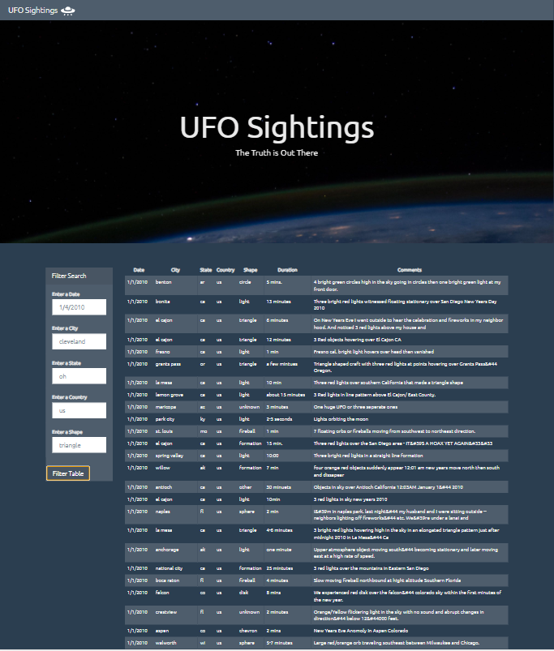

# javascript-challenge - ALIENS-R-REAL
Week 14 - Homework


ALIENS-R-REAL have collected eye-witness reports of extra-terrestrial sightings to publish this information online for the world to see. The volume of data is too large to search through manually therefore this assignment requires a code that will create a table dynamically based upon the dataset provided. Additionally the end users need to be able to filter the table data for specific values via applying JavaScript, HTML, and CSS, and D3.js on the web page.

## Assignment structure
```
javascript-challenge
|__ .gitignore                           # Gitignore file
|__ README.md                            # Markdown README
|  |__ images/                           # png screenshots
|       |__ nasa.jpg                     # README png
|__ UFO-level-1/                         # Level 1 directory
|    |__ static/                         # Static directory
|        |__ css/                        # CSS directory
|            |__ style.css               # Style.css file
|        |__ images/                     # Images directory
|            |__ nasa.jpg                # html png
|            |__ ufo.svg                 # html png
|    |__ js/                             # JavaScript directory
|        |__ app.js                      # JavaScript - Main
|        |__ data.js                     # JavaScript - Data
|    |__ index.html                      # Level 1 HTML
|__ UFO-level-2/                         # Level 2 directory
|    |__ static/                         # Static directory
|        |__ css/                        # CSS directory
|            |__ style.css               # Style.css file
|        |__ images/                     # Images directory
|            |__ nasa.jpg                # html png
|            |__ ufo.svg                 # html png
|    |__ js/                             # JavaScript directory
|        |__ app.js                      # JavaScript - Main
|        |__ data.js                     # JavaScript - Data
|    |__ index.html                      # Level 2 HTML

```

## Usage

```
JavaScript

* D3.js

HTML

* <!DOCTYPE html>
* <script src="https://cdnjs.cloudflare.com/ajax/libs/d3/4.11.0/d3.js"></script>
* <script src="static/js/data.js"></script>
* <script src="static/js/app.js"></script>

```

## Datasets 

|No|Source|Link|
|-|-|-|
|1|UFO Sightings Data 1|https://github.com/alysnow/javascript-challenge/blob/main/UFO-level-1/static/js/data.js|
|2|UFO Sightings Data 2|https://github.com/alysnow/javascript-challenge/blob/main/UFO-level-1/static/js/data.js|


## Level 1: Automatic Table and Date Search

* Create a basic HTML web page [index.html](UFO-level-1/index.html)

* Using the UFO dataset provided in the form of an array of JavaScript objects, write code that appends a table to your web page and then adds new rows of data for each UFO sighting. Make sure you have a column for `date/time`, `city`, `state`, `country`, `shape`, and `comment` at the very least.

* Use a date form in your HTML document and write JavaScript code that will listen for events and search through the `date/time` column to find rows that match user input.

*HTML page available via the following link https://alysnow.github.io/javascript-challenge/UFO-level-1/index.html*




## Level 2: Multiple Search Categories

* Complete all of Level 1 criteria.

* Using multiple `input` tags and/or select dropdowns, write JavaScript code so the user can to set multiple filters and search for UFO sightings using the following criteria based on the table columns:

  1. `date/time`
  2. `city`
  3. `state`
  4. `country`
  5. `shape`

*HTML page available via the following link https://alysnow.github.io/javascript-challenge/UFO-level-2/index.html*



## Contributor
- [Alysha Snowden](https://github.com/alysnow)